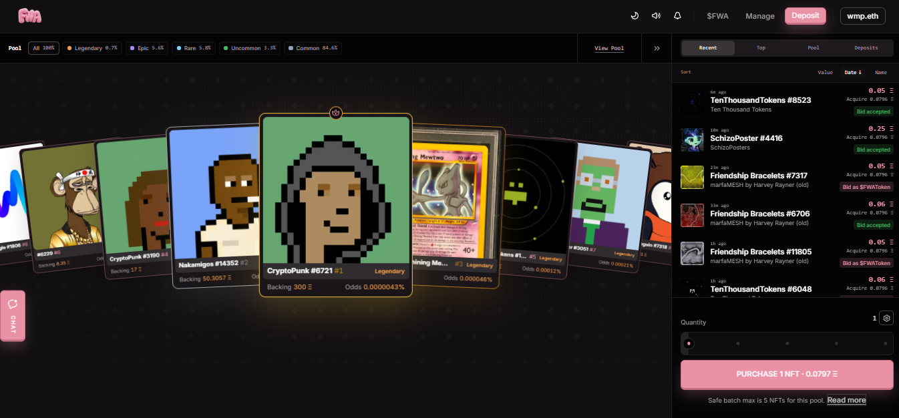
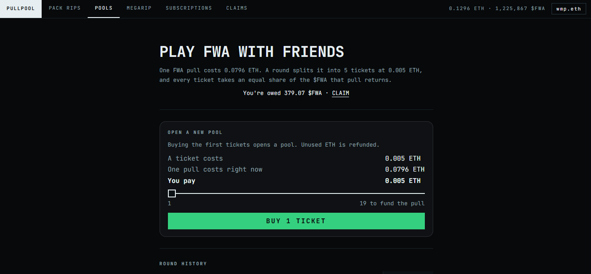
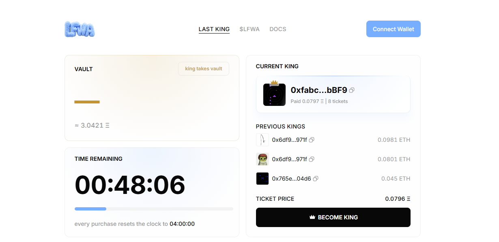
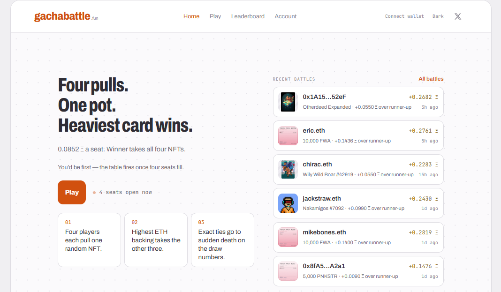
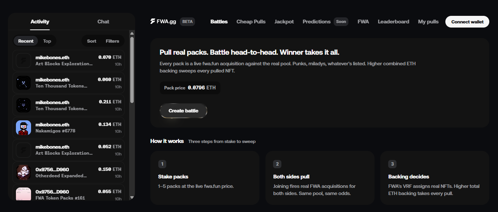

# Awesome Fake World Assets

Fake World Assets ([fwa.fun](https://www.fwa.fun/)) is a gacha app on Ethereum by [TokenWorks](https://x.com/token_works). The protocol, which lets users win onchain prizes like popular NFTs, did ~15,000 ETH worth of volume in its first month (July-Aug. 2026) and has expanded to support ERC-20s, non-Ethereum NFTs, tokenized collectibles (e.g. Pokémon cards), and primary drops.

Docs:
- [How it works](https://www.fwa.fun/docs/overview)
- [Deployments](https://www.fwa.fun/docs/deployments)
- [Testnet](https://www.fwa.fun/docs/testnet)

Dashboards:
- [FWA Pulse](https://fwa-pulse.vercel.app/) by [Pri](https://x.com/priyhhhhh)
- [FWA.Fun](https://dune.com/fookin_no_wan/fwa) by [FookinNoWan](https://x.com/Fookin_No_Wan)

Misc. Resources:
- [FWAAH!](https://fwaah.com/) — alternative frontend by [Austin Griffith](https://x.com/austingriffith)
- [Emblem](https://emblemwrapped.com/) — multichain wrapping service
- [DefiLlama](https://defillama.com/protocol/fake-world-assets) — analytics hub
- [GeckoTerminal](https://www.geckoterminal.com/eth/pools/0x230ecd3c25b44af30db59c15f70df7794eb13f67a200f230b7400daa96fe804d) — trading hub

Community Extensions:

### Pull Pool

Website: [pullpool.fun](https://pullpool.fun/) 

By: [ripe](https://x.com/ripe0x) 

101: Pull Pool is a suite of onchain tools for collectively funding Fake World Assets (FWA) pulls, letting users pool ETH to speedrun exposure and share $FWA settlements plus rewards pro-rata. It includes [Pack Rips](https://pullpool.fun/packs) for small shared packs of multiple pulls via cheap shares; [Pools](https://pullpool.fun/rounds) for concurrent ticket-based group pulls; [MegaRip](https://pullpool.fun/megarip) for large-scale, high-volume ripping events; and [Subscriptions](https://pullpool.fun/subscriptions) for automated standing orders that auto-enter future pools.

### LFWA

Website: [lfwa.fun](https://lfwa.fun/) 

X: [x.com/LFWAFUN](https://x.com/LFWAFUN) 

By: [madame/acc](https://x.com/madame1829) 

101: LFWA is a community liquid pool that farms $FWA rewards and ticket fees by maintaining large shared FWA NFT positions for better collective odds. Powered by the $LFWA token (30% tax on trades fills a treasury that deposits into FWA and buys back the token), it also runs a King-of-the-Hill game where buying a ticket makes you the temporary king who claims the entire vault by surviving 4 hours unchallenged.

### FWAP

Website: [fwap.fun](https://fwap.fun/) 

X: [x.com/FWAP_FUN](http://x.com/FWAP_FUN) 

By: [Quit](https://x.com/0xQuit) and [Jameson](https://x.com/0xOnward) 

101: FWAP (Fake World Asset Pools) is a shared onchain pool protocol where users deposit FWA-eligible NFTs and/or ETH. The assets are matched and listed into the Fake World Assets protocol at the minimum configured backing (currently 0.06 ETH). A keeper automatically recycles the positions in perpetuity, and all PNL plus FWA rewards are shared among depositors (with a configurable ETH:NFT split, currently favoring ETH).

### Gacha Battles

Website: [gachabattle.fun](https://gachabattle.fun/) 

X: [x.com/gachabattle](https://x.com/gachabattle) 

By: [eric](https://x.com/econoar) 

101: Gacha Battles is a 4-player winner-take-all game built on Fake World Assets. Each player pays for a seat and pulls one real NFT from the live FWA pool; the player whose NFT has the highest ETH backing wins all four NFTs (ties resolved by sudden death on draw numbers). Losers now split the $FWA rewards earned from the pulls.

### FWA.gg

Website: [fwa.gg](https://fwa.gg/) 

X: [x.com/fwadotgg](https://x.com/fwadotgg) 

By: [hov](https://x.com/hovwtf) 

101: FWA.gg is a gaming layer built atop Fake World Assets pulls. It features 1v1 pack battles (both sides pull, higher total ETH backing wins the pot, up to 10 pulls), a growing jackpot where every pull acts as a ticket, cheaper effective pulls, and upcoming onchain-resolved prediction markets.
